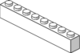
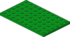
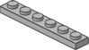

# PXIe-1082 chassis with controller

Parts list for PXIe-1082 (817 pieces). Parts list is also available as a [wishlist on BrickOwl](https://www.brickowl.com/wishlist/view/Dataflow_G/pxie-1082), and as a [BrickLink Want List](./PXIe-1082%20(BrickLink%20Want%20List).xml?raw=true).

## Parts List
If you're interested in purchasing bricks, have a look at [the buying guide](../../README.md#purchasing-bricks) on tips for getting the best price. This model can be bought for around $90-$100.

Item No: 2436a -> 2436b
Item No: 4032a -> 4032b
Item No: 59900 -> 4589b
Item No: 6141 -> 4073
Item No: 6141 -> 4073
Item No: 6141 -> 4073

Part Image | Part Number | Part Color | Quantity | Description
-----------|-------------|-----------------------|----------|------------
 | 11476 | Black | 2 | Plate 1 x 2 with Clip Horizontal on Side (Thick C-Clip)
 | 15535 | Black | 4 | Tile 2 x 2 Round with Hole
 | 15573 | Medium Stone Grey | 2 | Plate 1 x 2 with Groove with 1 Centre Stud, without Understud
 | 15712 | Medium Stone Grey | 4 | Tile 1 x 1 with Clip (Thick C-Clip)
 | 2357 | White | 10 | Brick 2 x 2 Corner
 | 2412b | Black | 10 | Tile 1 x 2 Grille with Groove
 | 2412b | White | 3 | Tile 1 x 2 Grille with Groove
 | 2412b | Tan | 18 | Tile 1 x 2 Grille with Groove
 | 2412b | Medium Stone Grey | 6 | Tile 1 x 2 Grille with Groove
 | 2420 | White | 8 | Plate 2 x 2 Corner
 | 2420 | Tan | 1 | Plate 2 x 2 Corner
 | 2431 | White | 1 | Tile 1 x 4 with Groove
 | 2431 | Medium Stone Grey | 8 | Tile 1 x 4 with Groove
 | 2436a | Medium Stone Grey | 7 | Bracket 1 x 2 - 1 x 4 with Square Corners
 | 2445 | White | 2 | Plate 2 x 12
 | 25214 | Black | 4 | Cylinder 2 x 2 Elbow with Axle Holes
 | 27263 | Medium Stone Grey | 2 | Tile 2 x 2 Corner without Corner
 | 2780 | Black | 2 | Technic Pin with Friction and Slots
 | 3001 | Medium Stone Grey | 3 | Brick 2 x 4
 | 3004 | Black | 2 | Brick 1 x 2
 | 3004 | White | 20 | Brick 1 x 2
 | 3005 | White | 6 | Brick 1 x 1
 | 3008 | White | 11 | Brick 1 x 8
 | 3009 | White | 7 | Brick 1 x 6
 | 30094 | Black | 2 | Plate 2 x 2 with Rod Frame Rectangular
 | 3010 | White | 8 | Brick 1 x 4
 | 3010 | Medium Stone Grey | 5 | Brick 1 x 4
 | 3020 | Black | 1 | Plate 2 x 4
 | 3020 | White | 2 | Plate 2 x 4
 | 3021 | Black | 3 | Plate 2 x 3
 | 3021 | White | 3 | Plate 2 x 3
 | 3022 | White | 2 | Plate 2 x 2
 | 3022 | Tan | 1 | Plate 2 x 2
 | 3023 | Black | 5 | Plate 1 x 2
 | 3023 | White | 10 | Plate 1 x 2
 | 3023 | Tan | 4 | Plate 1 x 2
 | 3023 | Medium Stone Grey | 7 | Plate 1 x 2
 | 3024 | Black | 6 | Plate 1 x 1
 | 3024 | Blue | 1 | Plate 1 x 1
 | 3024 | White | 15 | Plate 1 x 1
 | 3024 | Medium Stone Grey | 8 | Plate 1 x 1
 | 3024 | Dark Blue | 1 | Plate 1 x 1
 | 3028 | Medium Stone Grey | 2 | Plate 6 x 12
 | 3029 | Medium Stone Grey | 2 | Plate 4 x 12
 | 3031 | White | 2 | Plate 4 x 4
 | 3031 | Tan | 1 | Plate 4 x 4
 | 3032 | Green | 4 | Plate 4 x 6
 | 3032 | White | 6 | Plate 4 x 6
 | 3032 | Tan | 1 | Plate 4 x 6
 | 3033 | Green | 6 | Plate 6 x 10
 | 3033 | Medium Stone Grey | 1 | Plate 6 x 10
 | 3034 | White | 2 | Plate 2 x 8
 | 3035 | White | 2 | Plate 4 x 8
 | 30413 | red | 4 | Panel 1 x 4 x 1 with Rounded Corners
 | 30413 | White | 28 | Panel 1 x 4 x 1 with Rounded Corners
 | 30413 | Medium Stone Grey | 4 | Panel 1 x 4 x 1 with Rounded Corners
 | 3062b | Black | 6 | Brick 1 x 1 Round with Hollow Stud
 | 3062b | red | 2 | Brick 1 x 1 Round with Hollow Stud
 | 3062b | Medium Stone Grey | 10 | Brick 1 x 1 Round with Hollow Stud
 | 3068b | Black | 4 | Tile 2 x 2 with Groove
 | 3068b | White | 1 | Tile 2 x 2 with Groove
 | 3068b | Tan | 5 | Tile 2 x 2 with Groove
 | 3068b | Medium Stone Grey | 2 | Tile 2 x 2 with Groove
 | 3069b | Black | 6 | Tile 1 x 2 with Groove
 | 3069b | White | 3 | Tile 1 x 2 with Groove
 | 3069b | Tan | 1 | Tile 1 x 2 with Groove
 | 3069b | Medium Stone Grey | 10 | Tile 1 x 2 with Groove
 | 3070b | Black | 11 | Tile 1 x 1 with Groove
 | 3070b | yellow | 1 | Tile 1 x 1 with Groove
 | 3070b | White | 5 | Tile 1 x 1 with Groove
 | 3070b | Tan | 4 | Tile 1 x 1 with Groove
 | 3070b | Medium Stone Grey | 10 | Tile 1 x 1 with Groove
 | 32000 | White | 45 | Technic Brick 1 x 2 with Holes
 | 3460 | Green | 1 | Plate 1 x 8
 | 3460 | White | 24 | Plate 1 x 8
 | 3460 | Medium Stone Grey | 2 | Plate 1 x 8
 | 35787 | Medium Stone Grey | 1 | Tile 2 x 2 Triangular
 | 3622 | White | 26 | Brick 1 x 3
 | 3622 | Medium Stone Grey | 1 | Brick 1 x 3
 | 3623 | White | 22 | Plate 1 x 3
 | 3623 | Tan | 4 | Plate 1 x 3
 | 3623 | Medium Stone Grey | 2 | Plate 1 x 3
 | 3666 | White | 7 | Plate 1 x 6
 | 3666 | Medium Stone Grey | 4 | Plate 1 x 6
 | 3709b | White | 4 | Technic Plate 2 x 4 with Holes
 | 3710 | Blue | 1 | Plate 1 x 4
 | 3710 | White | 2 | Plate 1 x 4
 | 3710 | Tan | 4 | Plate 1 x 4
 | 3710 | Medium Stone Grey | 2 | Plate 1 x 4
 | 3713 | Medium Stone Grey | 2 | Technic Bush with Two Flanges
 | 3795 | White | 5 | Plate 2 x 6
 | 3832 | Black | 1 | Plate 2 x 10
 | 3832 | White | 2 | Plate 2 x 10
 | 4032a | Black | 4 | Plate 2 x 2 Round with Axlehole Type 1
 | 4162 | White | 3 | Tile 1 x 8
 | 4162 | Medium Stone Grey | 10 | Tile 1 x 8
 | 4274 | Medium Stone Grey | 10 | Technic Pin 1/2
 | 43093 | Blue | 4 | Technic Axle Pin with Friction
 | 44728 | Black | 4 | Bracket 1 x 2 - 2 x 2
 | 44728 | White | 56 | Bracket 1 x 2 - 2 x 2
 | 4477 | White | 12 | Plate 1 x 10
 | 4477 | Dark Blue | 2 | Plate 1 x 10
 | 4519 | Medium Stone Grey | 2 | Technic Axle 3
 | 4865b | red | 2 | Panel 1 x 2 x 1 with Rounded Corners
 | 4865b | White | 14 | Panel 1 x 2 x 1 with Rounded Corners
 | 4865b | Medium Stone Grey | 2 | Panel 1 x 2 x 1 with Rounded Corners
 | 54200 | White | 3 | Slope Brick 31 1 x 1 x 0.667
 | 54200 | Dark Blue | 8 | Slope Brick 31 1 x 1 x 0.667
 | 59900 | yellow | 2 | Cone 1 x 1 with Stop
 | 6041 | Black | 2 | Propellor 3 Blade 3.5 Diameter
 | 60478 | Black | 7 | Plate 1 x 2 with Handle on End
 | 60479 | White | 6 | Plate 1 x 12
 | 60479 | Medium Stone Grey | 2 | Plate 1 x 12
 | 6111 | White | 11 | Brick 1 x 10
 | 6112 | White | 6 | Brick 1 x 12
 | 61409 | Black | 5 | Slope Brick 18 2 x 1 x 0.667 Grille
 | 6141 | Transparent Green | 5 | Plate 1 x 1 Round
 | 6141 | Transparent Orange | 2 | Plate 1 x 1 Round
 | 6141 | Medium Stone Grey | 6 | Plate 1 x 1 Round
 | 62462 | Black | 4 | Technic Pin Joiner Round with Slot
 | 63864 | White | 2 | Tile 1 x 3 with Groove
 | 63864 | Medium Stone Grey | 2 | Tile 1 x 3 with Groove
 | 6541 | White | 33 | Technic Brick 1 x 1 with Hole
 | 6636 | White | 1 | Tile 1 x 6
 | 6636 | Medium Stone Grey | 7 | Tile 1 x 6
 | 6636 | Dark Blue | 2 | Tile 1 x 6
 | 85984 | Black | 4 | Slope Brick 31 1 x 2 x 0.667
 | 85984 | White | 11 | Slope Brick 31 1 x 2 x 0.667
 | 87079 | White | 2 | Tile 2 x 4 with Groove
 | 87079 | Medium Stone Grey | 16 | Tile 2 x 4 with Groove
 | 92280 | White | 5 | Plate 1 x 2 with Single Clip on Top
 | 98138 | Black | 1 | Tile 1 x 1 Round with Groove
 | 98138 | White | 2 | Tile 1 x 1 Round with Groove

Part images provided by [Peeron](http://peeron.com/).
