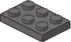

# cRIO-904x 4-slot Controller with C-Series modules

Parts list for cRIO-904x 4-slot (385 pieces). Parts list is also available as a [wishlist on BrickOwl](https://www.brickowl.com/wishlist/view/Dataflow_G/crio-904x-4-slot-controller), and as a [BrickLink Want List](./cRIO-904x%204-slot%20(BrickLink%20Want%20List).xml?raw=true).

## Parts List
Part Image | Part Number | Part Color (Alt Name) | Quantity | Description
-----------|-------------|-----------------------|----------|------------
 | 15573 | Medium Stone Grey | 8 | Plate 1 x 2 with Groove with 1 Centre Stud, without Understud
 | 2357 | Dark Stone Grey | 4 | Brick 2 x 2 Corner
 | 2412b | Medium Stone Grey | 2 | Tile 1 x 2 Grille with Groove
 | 2412b | Dark Stone Grey | 16 | Tile 1 x 2 Grille with Groove
 | 2420 | Dark Stone Grey | 16 | Plate 2 x 2 Corner
 | 2431 | Medium Stone Grey | 5 | Tile 1 x 4 with Groove
 | 2431 | Dark Stone Grey | 4 | Tile 1 x 4 with Groove
 | 2431 | Dark Blue | 4 | Tile 1 x 4 with Groove
 | 26603 | Dark Stone Grey | 10 | Tile 2 x 3
 | 3004 | Black | 1 | Brick 1 x 2
 | 3004 | Dark Stone Grey | 1 | Brick 1 x 2
 | 3005 | Dark Stone Grey | 6 | Brick 1 x 1
 | 3009 | Dark Stone Grey | 2 | Brick 1 x 6
 | 3010 | Dark Stone Grey | 1 | Brick 1 x 4
 | 30137 | Black | 2 | Brick 1 x 4 Log
 | 3020 | Black | 1 | Plate 2 x 4
 | 3021 | Dark Stone Grey | 5 | Plate 2 x 3
 | 3022 | Medium Stone Grey | 1 | Plate 2 x 2
 | 3022 | Dark Stone Grey | 4 | Plate 2 x 2
 | 3023 | Medium Stone Grey | 6 | Plate 1 x 2
 | 3023 | Dark Stone Grey | 15 | Plate 1 x 2
 | 3024 | Red | 1 | Plate 1 x 1
 | 3024 | Dark Stone Grey | 33 | Plate 1 x 1
 | 3028 | Dark Stone Grey | 1 | Plate 6 x 12
 | 3031 | Green | 3 | Plate 4 x 4
 | 3032 | Dark Stone Grey | 4 | Plate 4 x 6
 | 3035 | Green | 1 | Plate 4 x 8
 | 3062b | Medium Stone Grey | 2 | Brick 1 x 1 Round with Hollow Stud
 | 3068b | Black | 1 | Tile 2 x 2 with Groove
 | 3069b | Medium Stone Grey | 4 | Tile 1 x 2 with Groove
 | 3069b | Dark Stone Grey | 9 | Tile 1 x 2 with Groove
 | 3070b | Medium Stone Grey | 2 | Tile 1 x 1 with Groove
 | 3070b | Dark Stone Grey | 10 | Tile 1 x 1 with Groove
 | 32952 | Dark Blue | 24 | Brick 1 x 1 x 1.667 with Studs on 1 Side
 | 3623 | Dark Stone Grey | 7 | Plate 1 x 3
 | 3666 | Dark Stone Grey | 13 | Plate 1 x 6
 | 3700 | Dark Stone Grey | 2 | Technic Brick 1 x 2 with Hole
 | 3710 | Black | 1 | Plate 1 x 4
 | 3710 | Green | 1 | Plate 1 x 4
 | 3710 | Dark Stone Grey | 7 | Plate 1 x 4
 | 3710 | Dark Blue | 8 | Plate 1 x 4
 | 3958 | Dark Stone Grey | 1 | Plate 6 x 6
 | 4070 | Dark Stone Grey | 32 | Brick 1 x 1 with Headlight
 | 4162 | Dark Stone Grey | 2 | Tile 1 x 8
 | 44728 | Dark Stone Grey | 16 | Bracket 1 x 2 - 2 x 2
 | 4589 | Yellow | 1 | Cone 1 x 1
 | 6141 | Black | 6 | Plate 1 x 1 Round
 | 6141 | White | 1 | Plate 1 x 1 Round
 | 6141 | Transparent Green | 3 | Plate 1 x 1 Round
 | 6141 | Transparent Orange | 1 | Plate 1 x 1 Round
 | 6141 | Medium Stone Grey | 2 | Plate 1 x 1 Round
 | 6141 | Metallic Silver | 1 | Plate 1 x 1 Round
 | 63864 | Black | 1 | Tile 1 x 3 with Groove
 | 63864 | Medium Stone Grey | 10 | Tile 1 x 3 with Groove
 | 63864 | Dark Stone Grey | 1 | Tile 1 x 3 with Groove
 | 6541 | Dark Stone Grey | 12 | Technic Brick 1 x 1 with Hole
 | 6636 | Black | 1 | Tile 1 x 6
 | 6636 | Medium Stone Grey | 9 | Tile 1 x 6
 | 6636 | Dark Stone Grey | 5 | Tile 1 x 6
 | 87079 | Medium Stone Grey | 4 | Tile 2 x 4 with Groove
 | 87079 | Dark Stone Grey | 1 | Tile 2 x 4 with Groove
 | 87079 | Dark Blue | 4 | Tile 2 x 4 with Groove
 | 87087 | Dark Stone Grey | 4 | Brick 1 x 1 with Stud on 1 Side
 | 87087 | Dark Blue | 16 | Brick 1 x 1 with Stud on 1 Side
 | 98138 | Medium Stone Grey | 3 | Tile 1 x 1 Round with Groove

Part images provided by [Peeron](http://peeron.com/).
